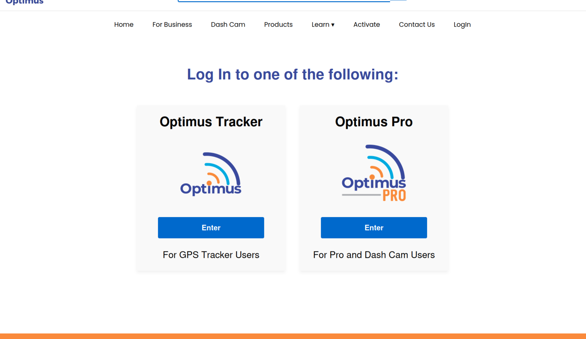
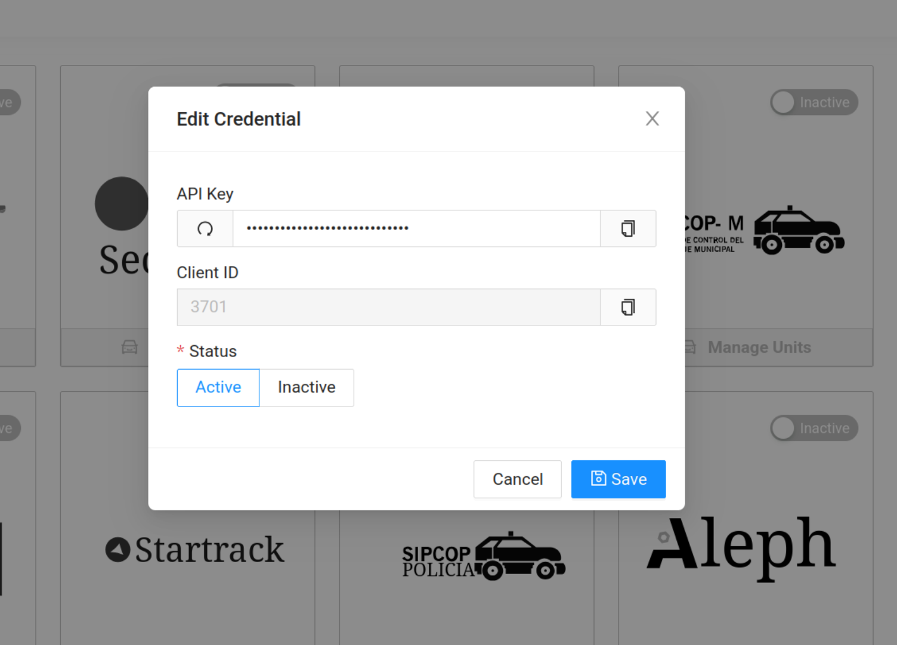

<h1 align='center'>ETL-Optimus</h1>

<p align='center'>Support brining Optimus GPS Fleet Tracking into TAK</p>

## Setup

1. Determine if your account is configured as an Optimus or Optimus Pro account. Only Optimus Pro accounts are supported for ingestion into TAK. You can determine which account type you have from the [Login Page](https://optimustracker.com/pages/log-in)



2. If you have an Optimus Tracker account and not an Optimus Pro account, contact support to have your account converted. There is no additional charge, just a more modern map UI for managing trackers and allowing external data integrations.

3. Once you have access to the Optimus Pro Account, from the main map page, click the menu button in the upper right-hand corner and then click "Integrations"
   
   

4. Activate the Optimus API 3P


5. Give the TAK Administrator the API Key & Client ID



## Development

DFPC provided Lambda ETLs are currently all written in [NodeJS](https://nodejs.org/en) through the use of a AWS Lambda optimized
Docker container. Documentation for the Dockerfile can be found in the [AWS Help Center](https://docs.aws.amazon.com/lambda/latest/dg/images-create.html)

```sh
npm install
```

Add a .env file in the root directory that gives the ETL script the necessary variables to communicate with a local ETL server.
When the ETL is deployed the `ETL_API` and `ETL_LAYER` variables will be provided by the Lambda Environment

```json
{
    "ETL_API": "http://localhost:5001",
    "ETL_LAYER": "19"
}
```

To run the task, ensure the local [CloudTAK](https://github.com/dfpc-coe/CloudTAK/) server is running and then run with typescript runtime
or build to JS and run natively with node

```
ts-node task.ts
```

```
npm run build
cp .env dist/
node dist/task.js
```

### Deployment

Deployment into the CloudTAK environment for configuration is done via automatic releases to the DFPC AWS environment.

Github actions will build and push docker releases on every version tag which can then be automatically configured via the 
CloudTAK API.

Non-DFPC users will need to setup their own docker => ECS build system via something like Github Actions or AWS Codebuild.
